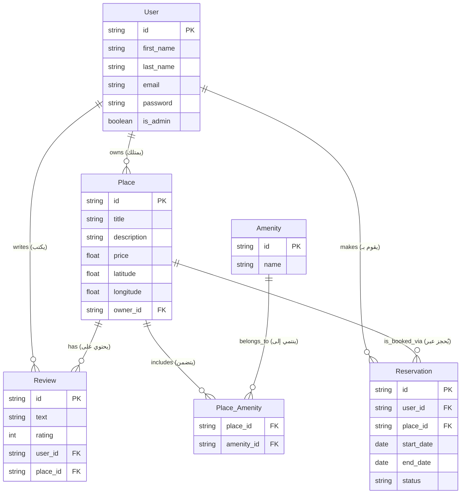

# Tasks-0: Application Factory & Configuration

In this task, the project structure was updated to follow the **Application Factory Pattern** for better scalability and environment management.

## Key Changes

| Feature                   | Description                                                                                                                             |
| ------------------------- | --------------------------------------------------------------------------------------------------------------------------------------- |
| **Dynamic Configuration** | Updated the `create_app()` function in `app/__init__.py` to accept a `config_class` parameter                                           |
| **Config Loading**        | Integrated `app.config.from_object(config_class)` to automatically load settings (like `DEBUG`, `SECRET_KEY`) from the `config.py` file |
| **Default Behavior**      | Set `config.DevelopmentConfig` as the default setting to ensure the app runs in development mode by default                             |
| **Clean Startup**         | Refactored `run.py` to use the factory instance, removing the need to manually pass `debug=True`                                        |

---

## Tasks-1: User Password Hashing

### Overview

Added secure password hashing to enhance API security using industry-standard practices.

### Implementation Details

- **Bcrypt Integration**: Added secure password hashing using `flask-bcrypt`
- **User Model**: Updated to include:
  - `hash_password` method
  - `verify_password` method
- **API Security**:
  - Modified `POST /api/v1/users/` to accept passwords
  - Passwords are strictly excluded from all `GET` responses via the serialization layer

### Code Example

```
python
# User model password methods
class User(BaseModel):
    def hash_password(self, password):
        self.password = bcrypt.generate_password_hash(password).decode('utf-8')

    def verify_password(self, password):
        return bcrypt.check_password_hash(self.password, password)
```

## Task 2: Implement JWT Authentication

### Objective

Implemented a secure JWT-based authentication system for the HBnB application, allowing users to log in and access protected resources using tokens.

### Changes Performed

| Step  | Component                         | Description                                                                                                                                                                                                                                                              |
| ----- | --------------------------------- | ------------------------------------------------------------------------------------------------------------------------------------------------------------------------------------------------------------------------------------------------------------------------ |
| **1** | **Configuration & Dependencies**  |                                                                                                                                                                                                                                                                          |
|       | `requirements.txt`                | Added `flask-jwt-extended` and `flask-bcrypt` to handle token management and password hashing                                                                                                                                                                            |
|       | `app/__init__.py`                 | Initialized JWTManager and Bcrypt within the application factory (`create_app`) and registered the new authentication namespace                                                                                                                                          |
| **2** | **User Security & Model Updates** |                                                                                                                                                                                                                                                                          |
|       | `app/models/user.py`              | Integrated bcrypt to securely hash passwords during user creation and implemented the `verify_password` method to validate credentials during login                                                                                                                      |
| **3** | **Authentication API**            |                                                                                                                                                                                                                                                                          |
|       | `app/api/v1/auth.py`              | Created a new `/login` endpoint that validates user credentials via the Facade and issues a JWT Access Token containing the user's ID and admin status (`is_admin`) as claims                                                                                            |
| **4** | **Service Layer (Facade)**        |                                                                                                                                                                                                                                                                          |
|       | `app/services/facade.py`          | Verified and utilized the `get_user_by_email` method to allow the authentication system to retrieve users from the repository based on their email addresses                                                                                                             |
| **5** | **API Protection (Middleware)**   |                                                                                                                                                                                                                                                                          |
|       | `app/api/v1/places.py`            | Applied the `@jwt_required()` decorator to sensitive endpoints (POST, PUT) to ensure only authenticated users can create or modify listings. Implemented `get_jwt_identity()` to automatically link new places to the authenticated user's ID, enhancing system security |

**Diagram Title:** The Magical Project ER 🌳

**Description:**  
Imagine the project as a magical tree. Each `entity` is a leaf on this tree, and the branches show how they are connected. The diagram shows **how entities relate to each other** using familiar symbols:

**Shapes and Symbols in the Diagram:**

- **Rectangle (`Entity`)**: Represents a main object or data type, like `User` or `Product`.
- **Diamond (`Relationship`)**: Represents a connection between entities, like "writes" or "enrolls in".
- **Oval (`Attribute`)**: Shows details about an entity, like `name`, `email`, or `price`.
- **Lines with symbols**: Show the type of relationship:
  - **`1---*`** : One-to-Many. A single branch supports many leaves. Example: one `User` can write many `Posts`.
  - **`*---*`** : Many-to-Many. Two branches share many leaves. Example: `Students` and `Courses` can link to many of each other.

## Task 3: Implementation of Authenticated User Access

### Objective

Secured specific API endpoints to ensure data integrity and enforce business rules regarding resource ownership.

### Key Logic Implemented

| Feature                  | Description                                                                                                                          |
| ------------------------ | ------------------------------------------------------------------------------------------------------------------------------------ |
| **Ownership Validation** |                                                                                                                                      |
|                          | Users can only update/delete Places they created                                                                                     |
|                          | Users can only update/delete Reviews they authored                                                                                   |
|                          | Users can only modify their own User Profiles                                                                                        |
| **Review Restrictions**  |                                                                                                                                      |
|                          | Implemented logic to prevent users from reviewing their own places                                                                   |
|                          | Restricted users to a maximum of one review per place to ensure authentic feedback                                                   |
| **Profile Integrity**    |                                                                                                                                      |
|                          | Explicitly blocked updates to email and password fields within the profile update endpoint to prevent unauthorized account hijacking |
| **Public Accessibility** |                                                                                                                                      |
|                          | Ensured that GET requests for places and reviews remain open to the public without requiring a JWT token                             |

This ER diagram gives you a **magical, visual view** of how data flows and relates in the project.


---
# Task 7: Map User Entity to SQLAlchemy Model

## Objective
This task transitions the HBnB application's User data from a volatile in-memory storage system to a persistent relational database. By integrating **Flask-SQLAlchemy** and **Flask-Bcrypt**, we mapped the `User` entity to a database table, implemented a dedicated `UserRepository`, and resolved Flask application context and circular import challenges.

## Key architectural Changes


### 1. The Extensions Module (`app/extensions.py`)
To prevent **Circular Import** errors between the Flask application factory and the SQLAlchemy models, a neutral extensions module was created.
* Global objects (`db`, `bcrypt`, `jwt`) are instantiated here.
* The `app/__init__.py` and all models import from this file, breaking the dependency loop.

### 2. Database Models
* **`BaseModel`**: Transformed into an abstract SQLAlchemy model (`__abstract__ = True`). It provides shared columns across all future tables: `id` (UUID string), `created_at`, and `updated_at`.
* **`User`**: Mapped to the `users` table. Includes constraints (e.g., `unique=True` for emails), SQLAlchemy `@validates` decorators for data integrity, and built-in methods for hashing and verifying passwords using `Bcrypt`.

### 3. Repository Pattern (`app/persistence/user_repository.py`)
Replaced the generic `InMemoryRepository` with a specialized `UserRepository` that inherits from `SQLAlchemyRepository`. 
* Encapsulates domain-specific queries, such as `get_user_by_email()`.
* Keeps the business logic cleanly separated from direct database queries.

### 4. The Facade (`app/services/facade.py`)
Updated the `HBnBFacade` to act as the bridge between the API layer and the new `UserRepository`. It intercepts user creation requests to hash passwords before passing the entity to the repository for persistence.

---

## Setup and Initialization

### Prerequisites
Ensure your virtual environment is activated and the required packages are installed:
```bash
pip install Flask-SQLAlchemy Flask-Bcrypt
```
## Initializing the Database
To create the SQLite database file and generate the users table based on your models, initialize the database via the Flask interactive shell:
```bash
# 1. Open the Flask application shell
flask shell

# 2. Inside the Python prompt, create the tables:
>>> from app.extensions import db
>>> db.create_all()
>>> exit()
```
Note: This will create an instance/ directory in your project root containing the .db file.
## API Testing
You can verify the integration is working by creating and retrieving a user via the API using cURL or Postman.

1. **Create a New User**:
```bash
curl -X POST "[http://127.0.0.1:5000/api/v1/users/](http://127.0.0.1:5000/api/v1/users/)" \
     -H "Content-Type: application/json" \
     -d '{
           "first_name": "John",
           "last_name": "Doe",
           "email": "john.doe@example.com",
           "password": "password123"
         }'
```
2. **Retrieve a User by ID**:
(Replace <user_id> with the UUID returned from the creation step)
```bash
curl -X GET "[http://127.0.0.1:5000/api/v1/users/](http://127.0.0.1:5000/api/v1/users/)<user_id>"
```

---
# Task 8: Entity-Relational Mapping (ERM) for Core Models

## 🎯 Executive Summary
The objective of this task is to transition the `Place`, `Review`, and `Amenity` entities from temporary, in-memory data structures to a persistent, relational database using **SQLAlchemy**. This process mirrors the data-mapping implementation previously completed for the `User` entity, establishing the foundational database schema required for the application's core business logic.

---

## 🧠 Architectural Concepts Applied
1. **Object-Relational Mapping (ORM):** Utilizing SQLAlchemy to translate Python classes into relational database tables, allowing for object-oriented database manipulation.
2. **Data Persistence:** Ensuring that entities created via the API are permanently stored in the database (`development.db`) rather than being lost when the server restarts.
3. **Repository Pattern:** Abstracting database queries into dedicated repository classes, keeping the business logic (Facade) decoupled from the direct database operations.


---

## ⚙️ Implementation Workflow

### 1. Model Definition (The Schema)
Each entity is defined as a standalone SQLAlchemy model with strict data types and constraints. 
* **Primary Keys:** Every entity is assigned a unique `id` defined as an `Integer` primary key.
* **Constraints:** Required fields utilize `nullable=False` to enforce data integrity at the database level.

**Entity Specifications:**
* **Place:** Attributes include `title` (String), `description` (String), `price` (Float), `latitude` (Float), and `longitude` (Float).
* **Review:** Attributes include `text` (String) and `rating` (Integer, constrained conceptually to 1-5).
* **Amenity:** Attributes include a `name` (String).

> ⚠️ **Architectural Constraint (Crucial):** > At this stage, **NO** relationships (Foreign Keys) are established between these entities. Each table is completely isolated. The mapping of relationships (e.g., linking a `Review` to a specific `Place` or `User`) is explicitly reserved for a subsequent task.

### 2. Repository Integration
Following the pattern established by the `UserRepository`, dedicated repositories must be created for the new entities:
* `PlaceRepository`
* `ReviewRepository`
* `AmenityRepository`

These repositories handle all basic CRUD (Create, Read, Update, Delete) operations using SQLAlchemy's session management.

### 3. Facade Reconfiguration
The central Service Layer (the Facade) is updated to route data through the new SQLAlchemy repositories instead of the legacy in-memory lists, successfully bridging the API endpoints with the persistent database.

---

## 🧪 Verification and Testing Protocol
To ensure the mapping complies with the business logic and successfully persists data, the following testing sequence is executed:

1. **Database Initialization:** Run `flask shell` followed by `db.create_all()` to physically construct the tables in the database based on the SQLAlchemy models.
2. **Endpoint Validation:** Utilize `cURL` or Postman to execute `POST`, `GET`, `PUT`, and `DELETE` requests for Places, Reviews, and Amenities. 
3. **Persistence Check:** Verify that the JSON payloads sent via the API successfully translate into new rows within the SQLite database.

---
## Task 9: Establishing Entity Relationships

### 📋 Overview
In this task, we transitioned the database from flat, independent tables to a relational schema. By implementing **Foreign Keys** and **SQLAlchemy Relationships**, we enabled the application to maintain referential integrity and traverse data logically (e.g., finding the owner of a place or all reviews for a specific property).

### 🛠 Implemented Relationships

#### 1. One-to-Many (1:N)
* **User ↔ Place:** A user can "own" multiple properties. We added `user_id` to the `Place` table.
* **User ↔ Review:** A user can write multiple reviews. We added `user_id` to the `Review` table.
* **Place ↔ Review:** A property can have multiple ratings. We added `place_id` to the `Review` table.

#### 2. Many-to-Many (N:M)
* **Place ↔ Amenity:** Since a place (like a house) can have many amenities (WiFi, Pool) and an amenity can belong to many houses, we implemented a **Join Table** called `place_amenity`. This table stores only the `place_id` and `amenity_id` pairs.


### 🔧 Technical Details
* **`backref`:** Used to create bidirectional access. For example, `place.owner` returns the User object, while `user.places` returns a list of Place objects.
* **`lazy='select'` vs `'subquery'`:** Optimized how data is loaded. One-to-many relationships use standard loading, while many-to-many uses `subquery` to fetch all related amenities efficiently.
* **Foreign Key Constraints:** Ensured that a review cannot exist without a valid user and place.

### 🚀 Verification
To apply these changes, the database must be recreated:
1. Delete the existing `development.db` file (or run `db.drop_all()` in shell).
2. Run `db.create_all()` in the Flask shell.
3. Test using the API by creating a User, then a Place using that User's ID, and finally a Review for that Place.