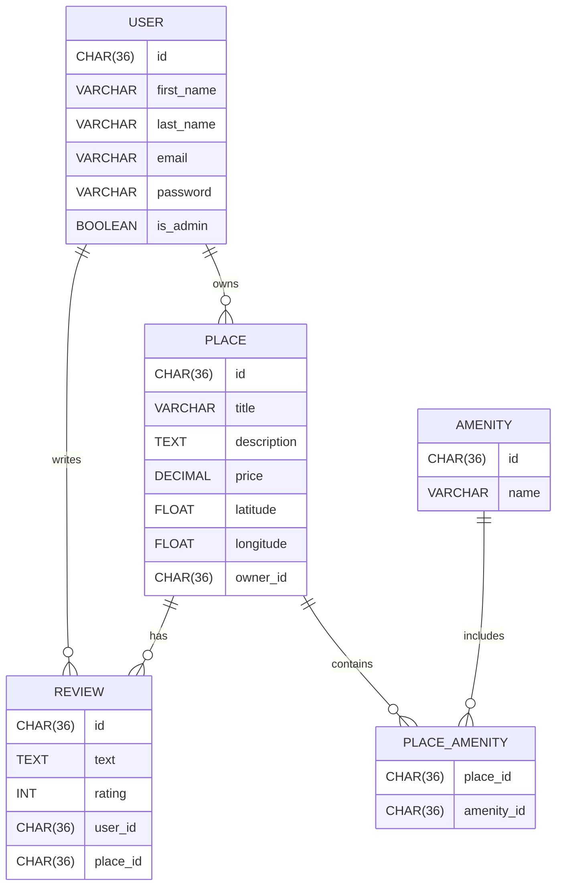

# HBnB Database ER Diagram

This document describes the Entity Relationship Diagram (ERD) for the HBnB project using **Mermaid.js**.

The database contains the following entities:

- User
- Place
- Review
- Amenity
- Place_Amenity (association table)

---

## ER Diagram

---

## Relationships

### User → Place
One **User** can own multiple **Places**.

### User → Review
One **User** can write multiple **Reviews**.

### Place → Review
One **Place** can have multiple **Reviews**.

### Place ↔ Amenity
Many-to-Many relationship implemented using **Place_Amenity**.

---

## Tables Summary

| Table | Description |
|------|-------------|
| User | Stores platform users |
| Place | Stores listings created by users |
| Review | Stores reviews written by users |
| Amenity | Stores amenities available in places |
| Place_Amenity | Join table between Place and Amenity |

---

## Notes

- All IDs are stored as **UUID (CHAR(36))**.
- Email field in **User** must be **unique**.
- A user **cannot review their own place**.
- A user can **only review a place once**.
